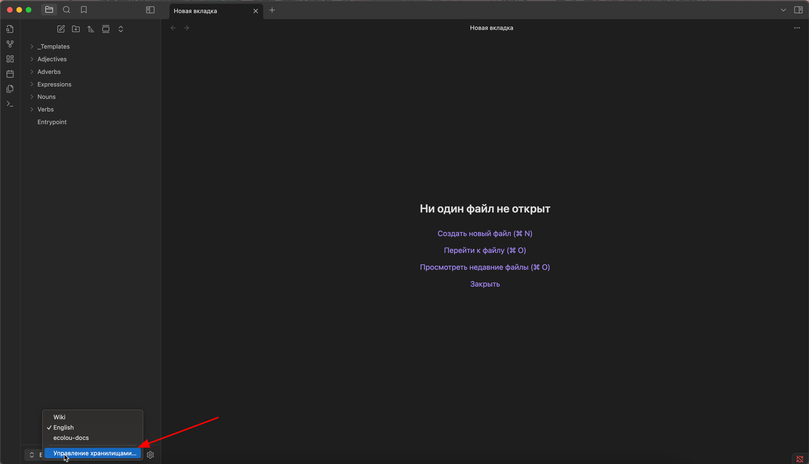
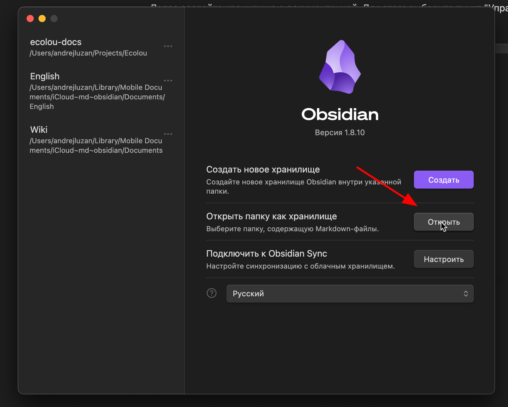
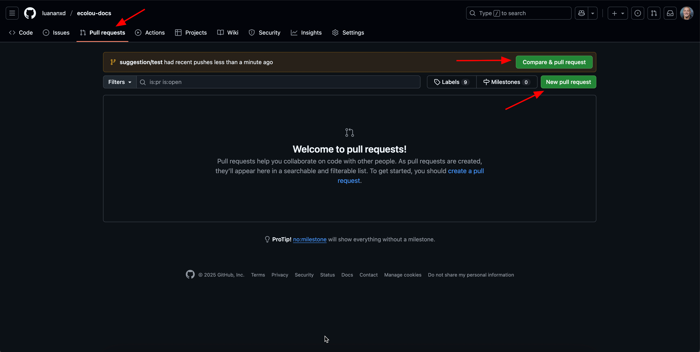
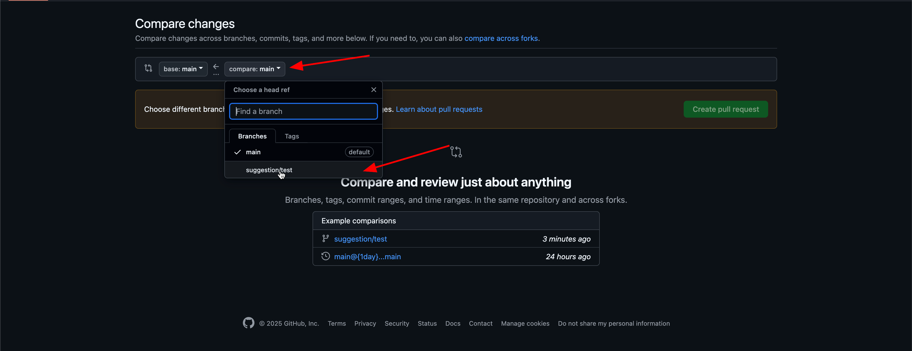
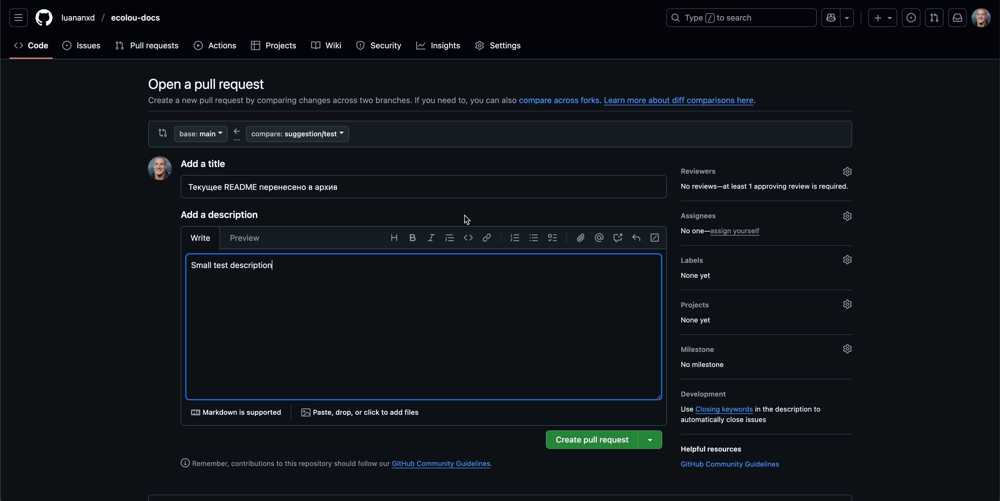

### Введение

Для корректной работы данной документации, просмотра и редактирования рекомендуется установить приложение [Obsidian](https://obsidian.md/).

Склонируйте себе репозиторий в любую удобную папку:

```bash
$ git clone https://github.com/luananxd/ecolou-docs.git
```

Далее создайте хранилище с документацией. Для этого выберите пункт _"Управление хранилищами"_ в левом нижнем углу:



В открывшемся модальном окне выберите _"Открыть папку как хранилище"_. Далее выберите папку на вашем диске:


Готово! Теперь вы можете полноценно просматривать и вносить правки в текст документации. Чтобы предложить изменения, создайте собственную ветку от `main`. Рекомендуется использовать следующий шаблон для имени ветки `suggestion/your-text`:

```bash
$ git checkout main
$ git chackout -b <your-branch-name>
```

Далее вы вносите изменения, создаете соответствующие коммиты. Для этого выполняете следующие команды в терминале (либо используете графический интерфейс, например, [GitHub Desktop](https://desktop.github.com/download/) или [VS Code](https://code.visualstudio.com/Download)):

```bash
$ git add .
$ git commit -m "Your message"
$ git push -u origin <your-branch-name>
```

После того, как работа завершена, перейдите на [GitHub](https://github.com/luananxd/ecolou-docs), в раздел _"Pull requests"._ Здесь вы увидите 2 кнопки:

- _"Compare & pull request"_ для недавно добавленных веток. Если это ваша ветка, создавайте PR прямо отсюда;
- _"New pull request"_ для создания PR на основе любой другой ветки



Далее вам нужно будет выбрать ветку, которую вы хотите предложить к рассмотрению. В нашем примере это `suggestion/test`. Далее нажимаем _"Create pull request"_:



На странице ниже пишем заголовок PR, короткий и емкий, чтобы было понятно, какие изменения вы предлагаете внести (по умолчанию это текст последнего коммита). После заполняет описание PR и нажимаем _"Create pull request"_:



Далее просто дожидаетесь, пока владелец документации одобрит ваши изменения, либо отклонит их с комментариями. Когда вы внесете изменения по комментариям, вы так же делаете коммиты **в той же ветке**, в которой работали до этого. Создавать новый PR не нужно, все ваши изменения автоматически добавятся к текущему PR.

### Структура документации

Документация состоит из следующих разделов:

1. `README.md` - Общая информация о документации и ее использовании.
2. `Бизнес-логика` - Информация о разделах платформах, их цели и задачи, которые они решают, описание интерфейсов, пользовательские сценарии, граничные условие и валидация, блок-схемы.
3. `Техническое описание` - Технические детали реализации тех или иных вещей, описание эндпоинтов, методов, структуры моделей, логики, которая заложена в поведение элементов платформы.
4. `Инструменты` - Документирование возможностей, которые имеют технологии, фреймворки и библиотеки, используемые для создания платформы. Служат материалом для погружения новых разработчиков.
5. `_Ресурсы` - Изображения, графики и прочие файлы, которые используются в документации

Ниже, схематичная структура документации:

```
ecolou-docs
├── _Ресурсы
│   ├── README
│   ├── Авторизация
│   └── ...
├── Бизнес-логика
│   ├── Авторизация
│   ├── Профиль пользователя
│   └── ...
├── Техническое описание
│   ├── Авторизация по одноразовому коду
│   ├── Внешие сервисы авторизации
│   └── ...
├── Инструменты
│   ├── Backend
│   │   ├── PostgeSQL
│   │   ├── Prisma
│   │   └── ...
│   ├── Frontend
│   │   └── ...
│   └── DevOps
│   │   └── ...
└── README.md
```
